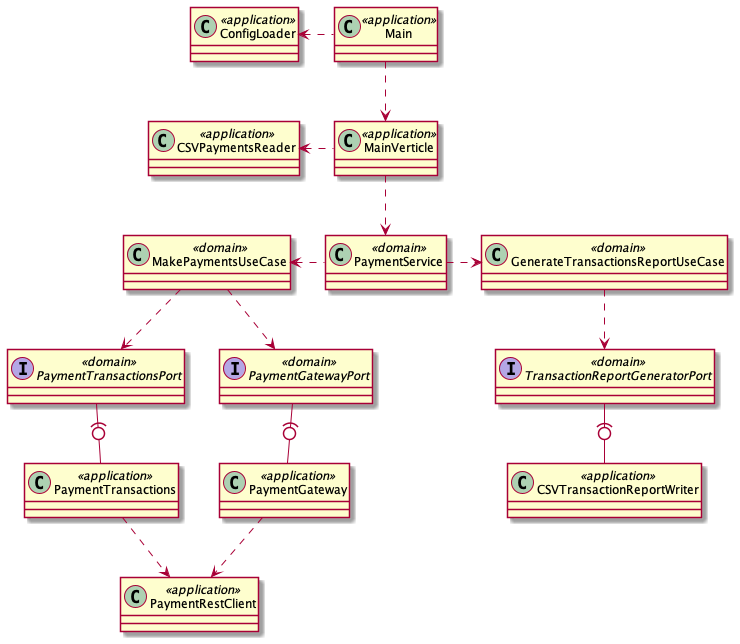

# Payments Client

A small concept project to allow a user to make a number of payments to recipients via a payment provider through the commandline.

This project explores:

* Functional testing with cucumber
* Using Test containers within tests
* Wiremock
* Writing a reactive application with Vert.X
* Using Hexagonal architecture principles to decouple core domain concerns from runtime and integration concerns.

As this is a concept project, testing mostly covers the happy paths and a few selected edge cases.

The application was written using an outside-in testing approach (BDD) using functional tests as the starting point and then using the unit test to guide the implementation to make the functional tests pass.

The functional tests are blackbox tests and the client application via docker with testcontainers. The payment provider is mocked through the use of wiremock.

The client code uses the Vert.X to create a reactive Java application. It was chosen because of it's relatively small memory footprint, simple library apis, community support and ecosystem of libraries that solve common problems such as configuration loading.

## Payments client application structure



One of the tradeoffs of Vert.X is the low-level programing model, which makes it very prone to leaking Vert.X concepts into the core domain of an application.

The summarised component view of the application structure shows how the integrations concerns are centralised around the core domain and the port interfaces decouple the Payments client usecases from the concrete implementations which integrate with non-domain concerns (rest, Vert.X,serialisation, deserialisation, boundary data transformations/validations and data formats).

Through the use of "port" interfaces from the core domain, integration aware code implements the interfaces to encapsulate the specifics of the integration and decouple the core domain from the outside world.

This separation of concern helped through enabling easier testability of the domain code through mocking the port interfaces rather than working about integration concerns.

This structure also made it easier to identify the parts which actually integrate with the external payment provider. It made sense to centralise this in the PaymentRestClient and scope the integration tests purely to this class and test the PaymentTransactions and PaymentGateway through providing them a mocked PaymentRestClient.

The tradeoffs with this application architecture are that:
- there could be deemed duplication of POJos between the "application" and "domain" boundaries.
- there is more overhead in maintaining packages, code and consideration in encapsulating domain concerns.

However, these tradeoffs are outweighed by the flexibility that this application architecture proposes. Each domain port enables new integration implementations without having to change domain logic or models. For example - the TransactionReportGeneratorPort could be implemented to write to a database, the PaymentGatewayPort could be implemented communicate over a different network protocol or message broker.
Furthermore, the domain is completely unaware that the input comes from a csv. This means that as long as the input to the domain is a recognised entity, the input source implementation could be via REST, database, etc.


## Running the application

### Prerequisites

 - Java 17
 - Docker version 20.10.6
 - Maven version 3.6.3

### Unit tests

```shell
mvn -pl client clean test
```

### Functional tests

```shell
mvn -pl functional-tests clean verify
```

### Run application

```shell
mvn -pl client clean package

java -jar ./client/target/payments-client-1.0.0-SNAPSHOT.jar --input=<input-csv-path> --output=<output-report-directory>
```
